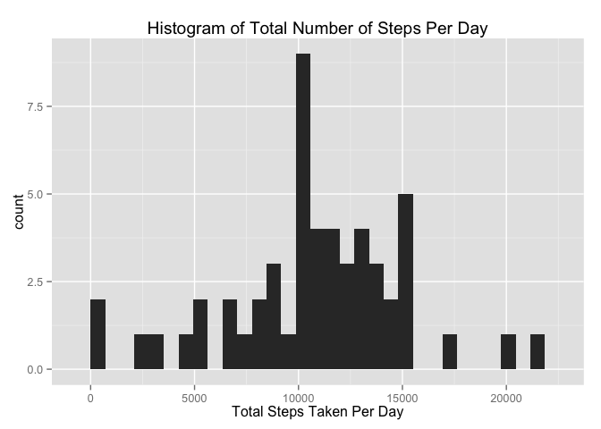
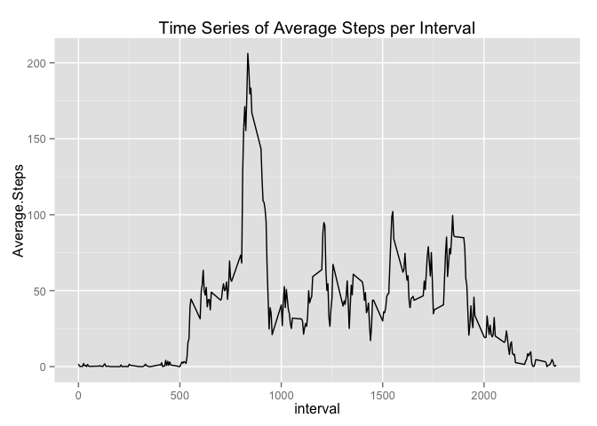
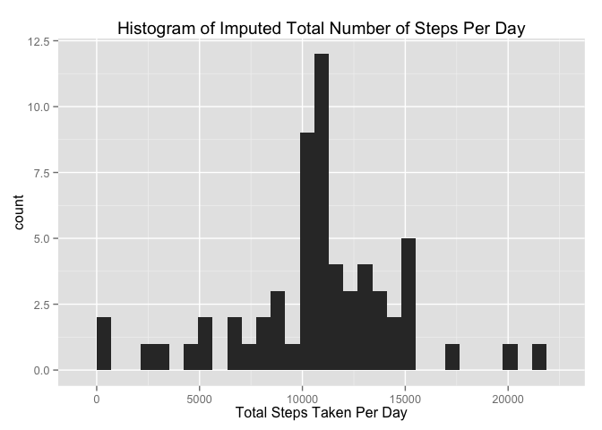
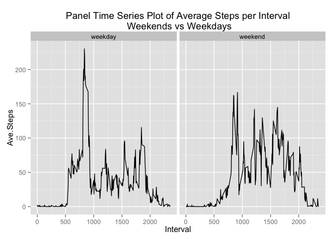

# Peer Assessment 1 for Reproducible Research
January 7, 2016  

##Load the data

```r
dat = read.csv('activity.csv')
```
##Question 1: "What is the mean total number of steps taken per day?"
###Q1 Part 1: Calculate the total number of steps taken per day.

```r
total_steps_per_day = aggregate(dat$steps, by = list(dat$date), sum)
names(total_steps_per_day) = c("Date", "Total.Steps")
head(total_steps_per_day)
```

```
##         Date Total.Steps
## 1 2012-10-01          NA
## 2 2012-10-02         126
## 3 2012-10-03       11352
## 4 2012-10-04       12116
## 5 2012-10-05       13294
## 6 2012-10-06       15420
```
###Q1 Part 2: Plot a histogram of the total number of steps taken each day

```r
library(ggplot2)
p1 = ggplot(total_steps_per_day, aes(Total.Steps)) + geom_histogram()
p1 = p1 + ggtitle("Histogram of Total Number of Steps Per Day")
p1 = p1 + labs(x="Total Steps Taken Per Day")
p1
```

```
## stat_bin: binwidth defaulted to range/30. Use 'binwidth = x' to adjust this.
```

 

###Q1 Part 3: Calculate and report the mean and median of the total number of steps taken per day

```r
mean_steps_per_day = mean(total_steps_per_day$Total.Steps, na.rm = TRUE)
paste("The MEAN number of steps taken per day is ", round(mean_steps_per_day, 4), ".", sep = "")
```

```
## [1] "The MEAN number of steps taken per day is 10766.1887."
```

```r
median_steps_per_day = median(total_steps_per_day$Total.Steps, na.rm = TRUE)
paste("The MEDIAN number of steps taken per day is ", median_steps_per_day, ".", sep = "")
```

```
## [1] "The MEDIAN number of steps taken per day is 10765."
```

## Question 2 : What is the average daily activity pattern?
###Q2 Part 1: Make a time series plot (i.e. type = "l") of the 5-minute interval (x-axis) and the average number of steps taken, averaged across all days (y-axis)
First create a new dataframe with all of the NAs removed, then use the "aggregate" function to get the average number of steps per interval

```r
good = which(!is.na(dat$steps))
dat_no_nas = dat[good,]
average_steps_by_interval = aggregate(dat_no_nas$steps, by = list(dat_no_nas$interval), mean)
names(average_steps_by_interval) = c("interval", "Average.Steps")
head(round(average_steps_by_interval, 4))
```

```
##   interval Average.Steps
## 1        0        1.7170
## 2        5        0.3396
## 3       10        0.1321
## 4       15        0.1509
## 5       20        0.0755
## 6       25        2.0943
```

```r
p2 = ggplot(average_steps_by_interval, aes(interval, Average.Steps)) + geom_line()
p2 = p2 + ggtitle("Time Series of Average Steps per Interval")
p2
```

 

###Q2 Part 2: Which 5-minute interval, on average across all the days in the dataset, contains the maximum number of steps?

```r
interval_with_ave_max_steps = average_steps_by_interval[which.max(average_steps_by_interval$Average.Steps),1]
paste("Interaval ", interval_with_ave_max_steps, " contains the max number of steps on average across all days.", sep = "")
```

```
## [1] "Interaval 835 contains the max number of steps on average across all days."
```

## Question 3: Imputing Missing Values

### Q3 Part 1: Calculate and report the total number of missing values in the dataset (i.e. the total number of rows with NAs)

```r
number_missing_values = sum(is.na(dat$steps))
paste("The total number of missing values is ", number_missing_values, ".", sep = "")
```

```
## [1] "The total number of missing values is 2304."
```

### Q3 Part 2: Devise a strategy for filling in all of the missing values in the dataset. The strategy does not need to be sophisticated. For example, you could use the mean/median for that day, or the mean for that 5-minute interval, etc.

```r
paste("Use the interval average across all days from Question 2 above in order to fill in missing values in the dataset")
```

```
## [1] "Use the interval average across all days from Question 2 above in order to fill in missing values in the dataset"
```

### Q3 Part 3: Create a new dataset that is equal to the original dataset but with the missing data filled in
- To do this, first use the "rep" function on the Average.Steps column in the average_steps_by_interval dataframe created in Question 2 part 1 to create a vector of the average interval values for each of the days in the original "dat" dataframe.
- Next cbind this vector as a column to a the original "dat" dataframe in a new dataframe called "new_dat". 
- Finally, check for NAs in the original steps data and replace this NA value with the average value for that interval.


```r
ave_steps = rep(average_steps_by_interval$Average.Steps, length(unique(dat$date)))
new_dat = cbind(dat, ave_steps)
head(new_dat)
```

```
##   steps       date interval ave_steps
## 1    NA 2012-10-01        0 1.7169811
## 2    NA 2012-10-01        5 0.3396226
## 3    NA 2012-10-01       10 0.1320755
## 4    NA 2012-10-01       15 0.1509434
## 5    NA 2012-10-01       20 0.0754717
## 6    NA 2012-10-01       25 2.0943396
```

```r
for(row_number in 1:dim(new_dat)[1]){
  if(is.na(new_dat[row_number,1])) {
    new_dat[row_number,1] = new_dat[row_number,4]
  }
}
head(new_dat)
```

```
##       steps       date interval ave_steps
## 1 1.7169811 2012-10-01        0 1.7169811
## 2 0.3396226 2012-10-01        5 0.3396226
## 3 0.1320755 2012-10-01       10 0.1320755
## 4 0.1509434 2012-10-01       15 0.1509434
## 5 0.0754717 2012-10-01       20 0.0754717
## 6 2.0943396 2012-10-01       25 2.0943396
```

### Q3 Part 4: Make a histogram of the total number of steps taken each day and Calculate and report the mean and median total number of steps taken per day. Do these values differ from the estimates from the first part of the assignment? What is the impact of imputing missing data on the estimates of the total daily number of steps?


```r
imputed_total_steps_per_day = aggregate(new_dat$steps, by = list(new_dat$date), sum)
names(imputed_total_steps_per_day) = c("Date", "Total.Steps")
check_total_steps_per_day = cbind(total_steps_per_day, imputed_total_steps_per_day$Total.Steps)

p3 = ggplot(imputed_total_steps_per_day, aes(Total.Steps)) + geom_histogram()
p3 = p3 + ggtitle("Histogram of Imputed Total Number of Steps Per Day")
p3 = p3 + labs(x="Total Steps Taken Per Day")
p3
```

```
## stat_bin: binwidth defaulted to range/30. Use 'binwidth = x' to adjust this.
```

 

```r
p1
```

```
## stat_bin: binwidth defaulted to range/30. Use 'binwidth = x' to adjust this.
```

 

```r
imputed_mean_steps_per_day = mean(imputed_total_steps_per_day$Total.Steps)
paste("The  MEAN number of steps taken per day with IMPUTED data included is ", round(imputed_mean_steps_per_day, 4), " .", sep = "")
```

```
## [1] "The  MEAN number of steps taken per day with IMPUTED data included is 10766.1887 ."
```

```r
imputed_median_steps_per_day = median(imputed_total_steps_per_day$Total.Steps)
paste("The MEDIAN number of steps taken per day with IMPUTED data included is ", imputed_median_steps_per_day, " .", sep = "")
```

```
## [1] "The MEDIAN number of steps taken per day with IMPUTED data included is 10766.1886792453 ."
```

```r
paste("The MEAN number of steps taken per day is ", round(mean_steps_per_day, 4), ".", sep = "")
```

```
## [1] "The MEAN number of steps taken per day is 10766.1887."
```

```r
paste("The MEDIAN number of steps taken per day is ", median_steps_per_day, ".", sep = "")
```

```
## [1] "The MEDIAN number of steps taken per day is 10765."
```
- The MEAN value does not differ with the imputed data included because missing values were simply replaced with the average step data per interval.  Thus, when this average data is included in the analysis, the overall mean value for all days does not change.  
- The MEDIAN value does differ but only very slightly, increasing from 10765 to 10766 when the imputed data is included.  This is because the 8 days of missing data are now being included in the count of overall days, thus impacting which value is exactly in the middle of the sorted list. 
- Imputing the average number of steps per interval for missing data serves to reinforce the average values that were determined when the missing data was not included in the first analysis. 

## Q5 Are there differences in activity patterns between weekdays and weekends?
### Q5 Part 1: Create a new factor variable in the dataset with two levels - "weekday" and "weekend" indicating whether a given date is a weekday or weekend day.

```r
Days = as.Date(as.character(new_dat$date))
Days = weekdays(Days)
new_dat = cbind(new_dat, Days)

weekends = c("Saturday", "Sunday")
new_dat = data.frame(new_dat, stringsAsFactors = FALSE)
for(each in 1:dim(new_dat)[1]){
  if(new_dat$Days[each] %in% weekends){
    new_dat[each,6] = as.character("weekend")
  }else{new_dat[each,6] = as.character("weekday")}
} 
names(new_dat)[6] = c("wkDAY_or_wkEND")
new_dat$wkDAY_or_wkEND = as.factor(new_dat$wkDAY_or_wkEND)
head(new_dat)
```

```
##       steps       date interval ave_steps   Days wkDAY_or_wkEND
## 1 1.7169811 2012-10-01        0 1.7169811 Monday        weekday
## 2 0.3396226 2012-10-01        5 0.3396226 Monday        weekday
## 3 0.1320755 2012-10-01       10 0.1320755 Monday        weekday
## 4 0.1509434 2012-10-01       15 0.1509434 Monday        weekday
## 5 0.0754717 2012-10-01       20 0.0754717 Monday        weekday
## 6 2.0943396 2012-10-01       25 2.0943396 Monday        weekday
```
### Q5 Part 2: Make a panel plot containing a time series plot (i.e. type = "l") of the 5-minute interval (x-axis) and the average number of steps taken, averaged across all weekday days or weekend days (y-axis).

```r
wkday_vs_weekend_averages = aggregate(new_dat[,1], by = list(new_dat$interval, new_dat$wkDAY_or_wkEND), mean)
names(wkday_vs_weekend_averages) = c("Interval", "Wkday_or_Wkend", "Ave.Steps")

p4 = ggplot(wkday_vs_weekend_averages, aes(Interval, Ave.Steps)) + geom_line()
p4 = p4 + ggtitle("Panel Time Series Plot of Average Steps per Interval\n Weekends vs Weekdays")
p4 = p4 + facet_grid(. ~ Wkday_or_Wkend)
p4
```

 
